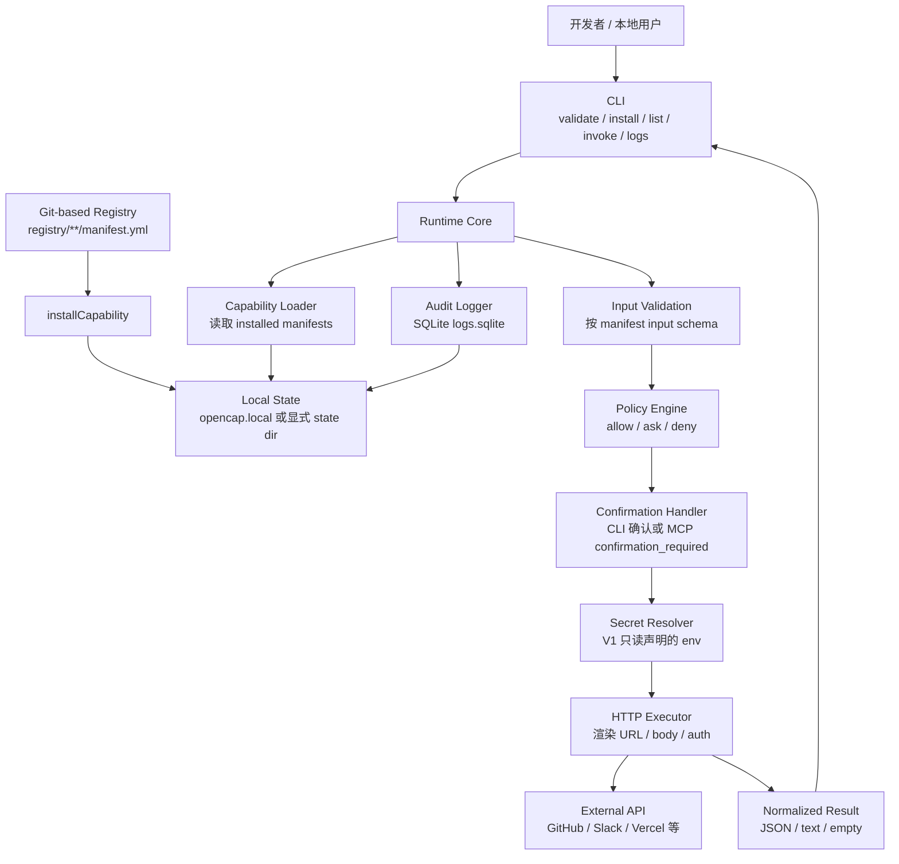

# 架构总览：OpenCap V1

本文是实现时的架构入口。整体系统模型见 `docs/设计/整体系统设计-v1.md`，Runtime 对外公共语言见 `docs/设计/runtime-kernel-contract-v1.md`，详细实施架构见 `docs/规划/v1-architecture.md`。

## 产品定位

OpenCap 是面向 AI 原生应用的本地优先 Capability Runtime。它让 AI Host 可以安全、可授权、可审计地调用真实世界 API。

OpenCap 不做通用 Agent、聊天入口、模型路由、prompt 编排、中心化 marketplace 或任意自动化平台。它位于 AI Host 和真实 API/业务系统之间，负责把 API、数据源和业务动作定义为 Capability，并在执行前完成标准化、权限判断、确认、密钥隔离、审计和证据生成。

```text
ChatGPT / Claude / Cursor / 企业内部 Agent
        |
        v
OpenCap Runtime
        |
        v
GitHub / Slack / Vercel / 内部 API / 数据源
```

一句话边界：AI Host 负责意图和交互，OpenCap 负责能力治理和安全执行，外部系统负责真实动作。

## 架构原则

1. Runtime 核心不依赖 MCP。
2. Policy 决策和 Confirmation 交互分离。
3. Executor 不允许绕过 Policy。
4. Audit Logger 是核心路径，不是插件。
5. V1 只支持 HTTP Capability。
6. 本地状态明确、可删除、可重建。
7. Evidence 只能解释和证明，不能替代 Policy、Consent 或 Audit。
8. Provider raw response 不直接进入 Host，必须先经过 Result Envelope、output validation、redaction 和 sanitizer。

## 总体模型

OpenCap V1 采用五个平面组织架构：标准面、控制面、执行面、信任面和互操作面。Runtime Core 是执行面内核，CLI/MCP/未来 API 都只是互操作入口；Registry、Policy、Audit、Trust 和 Compatibility 共同构成控制和证据体系。

面向产品和集成者时，可以把系统简化为四层：

```text
Capability Standard
  manifest / schema / permission / input-output / risk declaration
Local Runtime
  install / policy / confirmation / secret / executor / audit
Interop Gateway
  MCP now / future A2A / future OpenAPI / future HTTP API
Trust & Evidence Layer
  registry review / conformance / usage evidence / advisory / revocation
```

这四层共同形成 OpenCap 的核心价值：调用前可判断，调用中可隔离，调用后可追踪，能力包可评审、可安装、可撤销。

## 模块图

```text
CLI
 | validate/install/list/invoke/logs/serve
 v
Runtime Core
 | Capability Loader
 | Input Validator
 | Policy Engine
 | Policy Decision Trace Builder
 | Policy Change Ledger
 | Runtime Ledger Storage Contract
 | Runtime Card Generation Contract
 | Capability Identity Contract
 | Confirmation Handler
 | Secret Resolver
 | HTTP Executor
 | Audit Logger
 v
Local State + External APIs

MCP Bridge
 | tool list
 | tool call
 v
Runtime Core
```

## V1 Runtime 主路径图



说明：上图描述当前 V1 的 CLI 到 Runtime 主路径。`@opencap/mcp` 已有 tool name 映射、`tools/list` 投影和 `tools/call` 路由 helper，但完整 `opencap serve --mcp` server 仍在后续任务中实现。

## 包职责

### `@opencap/spec`

- Manifest TypeScript 类型
- Manifest JSON Schema
- Manifest validation helper
- Registry validation script

### `@opencap/cli`

- 用户命令入口
- 参数解析
- 调用 规范/runtime/mcp 包
- 不承载核心业务逻辑

### `@opencap/runtime`

- Runtime Kernel public contract 类型
- 本地状态路径
- install/list/invoke 能力
- policy evaluation
- confirmation orchestration
- HTTP execution
- audit logging

### `@opencap/mcp`

- MCP tool 描述生成
- MCP server 启动
- tool name collision 检测
- 将 MCP tool call 转为 Runtime invocation

### `@opencap/sdk`

- V1 暂不实现
- 后续用于代码式 Capability 定义

## 本地状态结构

```text
opencap.local/
  installed/
    github.create_issue/
      manifest.yml
      README.md
      tests/
        basic.yml
  policies.yml
  logs.sqlite
```

## 核心数据对象

### CapabilityManifest

来自 `manifest.yml`，必须通过 schema 校验。

### InstalledCapability

Runtime 加载后的能力对象，包含：

- manifest
- install path
- trust metadata
- derived risk summary

### InvocationRequest

一次调用请求：

- capability id
- channel: `cli` / `mcp` / future `http`
- host id
- input
- dry-run flag

### PolicyDecision

策略输出：

- decision: `allow` / `ask` / `deny`
- reason
- matched rule
- policy revision
- redacted decision trace id

### InvocationLog

一次调用的审计记录。

## 调用顺序

```text
load manifest
  -> validate input
  -> classify input
  -> minimize input and build egress map
  -> evaluate data egress policy
  -> evaluate quota/budget/rate gates
  -> evaluate policy
  -> build policy decision trace
  -> apply allowed override if present
  -> resolve confirmation if needed
  -> resolve secrets
  -> execute or dry-run
  -> normalize output
  -> validate output schema
  -> redact and sanitize result
  -> build Result Envelope
  -> write audit log
  -> write usage/evidence record when applicable
  -> adapt result to CLI/MCP
```

## 重要边界

### MCP 边界

MCP Bridge 只负责协议适配。它不决定权限、不直接读 secret、不直接执行 HTTP。

### Policy 边界

Policy Engine 只给决策，不做用户交互。`ask` 交给 Confirmation Handler。

### Secret 边界

Secret Resolver 可以读取 env，但不得把 secret 返回给 Capability output、Result Envelope、MCP result 或 audit log。

### HTTP 边界

HTTP executor 只接收已经通过 policy 和 confirmation 的请求。

### Runtime Kernel 边界

CLI、MCP、未来 Console/API 都必须通过 Runtime public contract 进入调用主路径，不能各自拼接 validation、policy、secret、executor 或 audit 流程。Runtime Kernel 是唯一能把 Capability invocation 从输入推进到 Result Envelope 和 audit evidence 的组件。

### Evidence 边界

Trust Card、Quality Score、Usage Event、Problem Details、Compatibility Record 和 Conformance Record 都是证据对象。它们可以解释风险、质量、兼容性和调用结果，但不能把 `ask` 改成 `allow`，不能覆盖 `deny`，不能绕过 egress deny、outbound block、secret ordering、revoked/malicious block 或 audit preflight。

## V1 架构收敛路线

下一阶段不再继续扩散零散 P2 能力，而是把 V1 收敛到一个可运行、可解释、可验证的主链路：

```text
MCP Host
  -> OpenCap MCP Bridge
  -> Runtime Kernel
  -> Policy / Egress / Quota / Consent Gates
  -> Secret Resolver
  -> HTTP Executor
  -> Result Envelope
  -> MCP or CLI Adapter
  -> Audit + Usage Evidence + Conformance
```

收敛优先级：

1. 完成 `opencap serve --mcp`，让 MCP Host 能发现和调用已安装 Capability。
2. 以 `github.create_issue` 作为 V1 demo，证明 Host -> MCP -> Runtime -> HTTP -> Audit 主链路。
3. 定义 Usage Event、quota/rate Problem Details 和 Usage Export，作为 non-billing evidence，不引入计费。
4. 用 conformance record 验证 MCP、usage、problem details、audit 和 result envelope 边界。
5. 保持文档状态和实现状态一致，未实现能力必须标注为设计中、阻塞或未来扩展。

## 未来扩展点

- OPA/Rego policy backend
- OpenTelemetry export
- OS keychain secret storage
- MCP proxy Capability
- OpenAPI adapter
- Console UI
- self-hosted registry

## 体系化设计文档

架构实现时优先对齐以下文档：

- `docs/设计/整体系统设计-v1.md`：五个平面、三条主链路、Runtime Kernel、账本和卡片模型。
- `docs/设计/runtime-kernel-contract-v1.md`：Runtime Kernel 对 CLI、MCP 和未来入口暴露的公共契约。
- `docs/设计/domain-model.md`：对象、关系和不变量。
- `docs/设计/runtime-contracts.md`：Runtime 调用管线和模块契约。
- `docs/协议/protocol-positioning.md`：MCP、A2A、OpenAPI 和 Apps SDK 的边界。
- `docs/安全/threat-model.md`：安全边界和威胁控制。
- `docs/运营/release-readiness.md`：发布门禁和质量要求。

## 实现前接口契约

进入代码实现时，还必须对齐：

- `docs/设计/cli-contract-v1.md`：CLI 命令、输出、exit code。
- `docs/设计/local-state-v1.md`：state dir、installed 目录和写入规则。
- `docs/设计/configuration-v1.md`：flag/env/state dir 配置优先级。
- `docs/设计/mcp-interface-v1.md`：MCP tools/list、tools/call 和 confirmation_required。
- `docs/设计/error-model-v1.md`：统一错误分类。
- `docs/安全/privacy-retention-v1.md`：日志隐私和数据保留。
- `docs/规划/v1-implementation-plan.md`：V1 实施顺序。


### Result 边界

外部 provider response 不直接返回给 MCP Host。Runtime 必须先完成 output validation、redaction、sanitization 和 Result Envelope 生成，再由 CLI/MCP adapter 投递。


### Data Egress 边界

Input schema validation 之后，Runtime 必须先执行 input classification、data minimization 和 data egress policy。egress deny 不解析 secret、不发请求，且写入 redacted audit evidence。

### Policy Governance 边界

Policy 不只是 `policies.yml`。Runtime 必须记录 active policy revision、decision trace、override record 和 policy change ledger。策略放宽，尤其是 broad allow 或 ask/deny -> allow，必须经过 simulation/diff 检查。Breakglass 只能影响普通 risk policy 的 effective decision，不能绕过 audit、egress deny、outbound block、secret ordering 或 revoked/malicious block。
